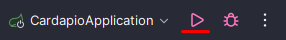

<h1>Cardápio Digital</h1>

<p align="center">
  <a href="#pre-requisites">Pré-requisitos</a> •
  <a href="#how-to-use">Instalando o projeto</a> •
  <a href="#application">Aplicação</a>•
</p>

<h2 id="application">📺 Aplicação</h2>
Este projeto é um simples protótipo de um Cardápio Digital, aonde é alocado no bando de dados as imagens, preços, e nome das comidas de um cardápio digital no banco de dados.
<br>
Foi desenvolvida utilizando **Java Spring e Spring MVC** para criação do servidor, **Spring Data JPA** para manipulação e persistência de dados, **Lombok** para geração de boilerplates e Postgres Driver para realizar a conexão com banco de dados Postgres.

<h2 id="pre-requisites">💻 Requisitos</h2> 

Para rodar esse projeto você precisa ter o Java instalado na sua máquina. (Usamos a versão 17 nessa aplicação).
<br>

Criar o projeto com spring e adicionar as dependências conforme abaixo 👇.
<br>

📎 Link para iniciar com spring: https://start.spring.io/


<h2 id="how-to-use"> 🚀 Instalando o projeto</h2>

Primeiro você deve clonar o repositório,

```bash
# Clone o repositório
$ git clone https://github.com/ghenoo/Cardapio-digital

# Acesse-o
$ cd Cardapio-digital
```

Agora, dentro do IntelliJ, vamos instalar as depedências com o Maven


E por fim, entre no arquivo da classe `CardapioApllication` para executar o projeto



